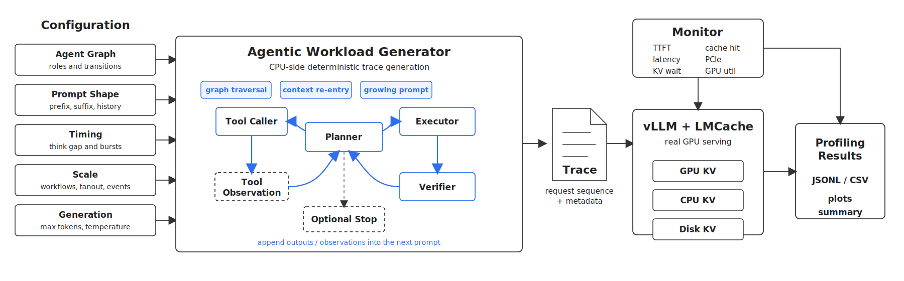

# Agentic Workload Generator



This project generates controlled agentic workloads for serving-system profiling. It does not try to build a smart agent. Instead, it simulates the serving-side shape of agent execution: graph traversal, repeated context re-entry, growing prompts, short generations, and many concurrent workflows.

The generator runs on the CPU and produces request traces. A real backend, such as `vLLM + LMCache`, still performs the actual prefill, decode, KV cache management, offload, scheduling, and GPU execution.

## Configuration

Workloads are defined by JSON config files in `configs/`. The config controls what the agent graph looks like, how large the prompts are, how often workflows re-enter the backend, and how much pressure the backend sees.

| Config area | Keys | What it means |
| --- | --- | --- |
| Agent graph | `agents`, `workflow_graph` | Defines the agent loop. For example: `planner -> toolcaller -> planner -> executor -> verifier -> planner`. Repeated visits to the same role create context re-entry. |
| Prompt shape | `prompt_mode`, `prefix_len_tokens`, `suffix_len_tokens` | Controls the prompt structure. `static_prefix` reuses stable per-role prefixes. `growing_history` appends synthetic outputs and observations so later steps look like a real agent transcript. |
| History growth | `history_assistant_len_tokens`, `history_observation_len_tokens`, `history_max_prefix_len_tokens` | Controls how quickly the prompt grows in `growing_history` mode and whether old history is truncated to stay inside the model context window. |
| Timing | `mean_think_time_s`, `think_time_jitter_s`, `burst_probability`, `burst_delay_multiplier` | Controls the gap between agent steps. Shorter gaps create denser pressure; longer gaps make KV reactivation and offload effects easier to see. |
| Scale | `num_workflows`, `duration_s`, `max_events`, `branch_fanout` | Controls workload size and concurrency. More workflows and fanout increase KV working set and backend pressure. |
| Generation | `max_tokens_dist`, `temperature`, `top_p` | Controls output length and sampling. Agentic profiling usually uses short outputs because many agent steps are small decisions or tool calls. |
| Tokenization | `tokenizer_name`, `tokenizer_local_files_only` | Controls token length accuracy. Use the target model tokenizer for real profiling; the fallback tokenizer is only for quick structure checks. |

Two prompt modes matter most:

```text
static_prefix:
  request = stable workflow/agent prefix + per-step suffix
```

```text
growing_history:
  step 1 = base prefix + suffix1
  step 2 = base prefix + synthetic output1 + observation1 + suffix2
  step 3 = base prefix + output1 + observation1 + output2 + observation2 + suffix3
```

Use `growing_history` when you want a more realistic agent transcript. Use `static_prefix` when you want a cleaner prefix-reuse stress test.

## Installation

Clone the repo and enter the project root:

```bash
git clone https://github.com/Samfisheryu/Agentic-Workload-Generator.git
cd Agentic-Workload-Generator
```

Create a Python environment and install the common runtime packages:

```bash
python -m venv .venv
source .venv/bin/activate
pip install requests transformers pyyaml psutil matplotlib nvidia-ml-py
```

`requests` is needed for replay. `transformers` is needed when you want model-accurate token lengths. The monitoring scripts use `psutil`, NVML bindings, and `matplotlib`.

## Experiment Scenarios

The configs are meant to describe experiment scenarios, not just parameter presets.

| Config | Scenario |
| --- | --- |
| `sanity_small.json` | Minimal static-prefix smoke test. Use this first to check that trace generation works. It does not try to create realistic agent pressure. |
| `sanity_growing.json` | Minimal growing-history smoke test. Use this to verify that each workflow step appends synthetic outputs and observations into later prompts. |
| `pressure_medium.json` | Backend-independent synthetic pressure test using the fallback tokenizer. Useful for quick workload-shape experiments before choosing a real model tokenizer. |
| `pressure_qwen3_8b_moderate.json` | Moderate Qwen3-8B workload. This is a reasonable first real-backend run when you do not want to immediately stress KV offload. |
| `pressure_qwen3_8b_offload_high.json` | High-concurrency KV pressure workload. It uses many workflows, long prefixes, bursts, and fanout to push the backend toward cache pressure and offload. |
| `pressure_qwen3_8b_offload_stable.json` | Less bursty offload experiment. Use it when you want cleaner measurements and fewer burst-induced tail spikes. |
| `retrieve_focus*.json` | Retrieve-focused workloads with lower concurrency and longer reactivation gaps. These are useful when you want to make KV reload behavior easier to observe. |
| `growing_history_gap4_wf32_p8k_c24.json` | More agent-like workload: growing history, 32 workflows, 4s think gap, 8K base prefix, capped prompt history, and closed-loop replay. This is the main config for studying agentic re-entry with realistic prompt growth. |

## Running Experiments

Use manual trace replay when you already have a backend running. This is the intended open-source path because backend startup commands are usually machine-specific.

```bash
python generate_trace.py \
  --config configs/sanity_growing.json \
  --out-dir /tmp/agentic_sanity

python analyze_trace.py \
  --trace /tmp/agentic_sanity/trace.jsonl

python replay_trace.py \
  --trace /tmp/agentic_sanity/trace.jsonl \
  --prefix-bank /tmp/agentic_sanity/prefix_bank.jsonl \
  --results /tmp/agentic_sanity/client_results.jsonl \
  --base-url http://localhost:8000/v1 \
  --model Qwen/Qwen3-8B \
  --mode closed-loop \
  --endpoint completions
```

This generates a trace, checks its shape, and sends it to an OpenAI-compatible endpoint. Use `--mode closed-loop` for agent-like replay, where each workflow waits for the previous step to finish before sending the next one. Use `--mode open-loop` for fixed-arrival-rate pressure tests.
